# The Price of Professionalism
### Does Player Market Value Drive Disciplinary Behavior in Football?

**DSA 210 – Introduction to Data Science | Sabancı University | 2025–2026 Spring Term**  
**Onur Utku Batmaz**

---

## Motivation

Football is the world's most popular sport, yet it is also one of its most financially unequal. The past two decades have witnessed an unprecedented commercialization of the game: transfer fees now routinely exceed €100 million, average player salaries at top clubs run into tens of millions per year, and squad valuations at elite sides have surpassed €1 billion.

The central question motivating this project is deceptively simple: **does money buy discipline?** Do teams that invest heavily in their squads (as measured by average player market value, AMV) receive fewer disciplinary sanctions than their lower-budget counterparts? There are two competing intuitions:

- Technically superior, expensive players may rely on skill rather than physical aggression, naturally incurring fewer fouls and cards.
- Financial pressure at elite clubs might push managers to adopt more disciplined tactical systems to protect expensive assets.

---

## Hypothesis

| | |
|---|---|
| **H₀** | There is no relationship between a team's average player market value and its disciplinary record. |
| **H₁** | Teams with higher average player market values receive fewer disciplinary points (negative correlation). |

---

## Data Sources

| Source | Variables | Method |
|--------|-----------|--------|
| FBRef (via StatBomb) | Yellow cards, red cards, possession % | Manual export via "Share & Export → Get table as CSV" |
| Transfermarkt | Squad size, total market value | Manual collection |

### Dataset

- **583** team-season observations
- **6 leagues:** Premier League, La Liga, Serie A, Bundesliga, Ligue 1, Süper Lig
- **5 seasons:** 2020–21 through 2024–25

### Engineered Features

| Feature | Formula | Description |
|---------|---------|-------------|
| Discipline Points | CrdY × 1 + CrdR × 3 | Weighted aggression score per team per season |
| AMV (€M) | Total Squad Value / Squad Size | Normalized average market value per player |
| CoA | Discipline Points × AMV | Cost of Aggression Index |

> **Data note:** Gaziantep FK and Hatayspor were excluded from the 2022–23 Süper Lig season following their mid-season withdrawal after the February 2023 earthquake. The remaining teams played between 34 and 35 nineties, a difference of less than 3%, deemed insufficient to warrant normalization.

---

## Repository Structure

```
DSA210-Project/
│
├── data/
│   ├── raw/                        # Per-league Excel files
│   │   ├── PL_Combined.xlsx
│   │   ├── LaLiga_Combined.xlsx
│   │   ├── SerieA_Combined.xlsx
│   │   ├── Bundesliga_Combined.xlsx
│   │   ├── Ligue1_Combined.xlsx
│   │   ├── SuperLig_Combined.xlsx
│   │   └── Master_Dataset.xlsx
│   └── processed/
│       └── master_dataset.csv      # Combined 583-row dataset
│
├── scripts/
│   ├── 01_data_collection.py       # Data pipeline documentation
│   ├── 02_eda.py                   # Exploratory data analysis + plots
│   ├── 03_hypothesis_testing.py    # Statistical hypothesis tests
│   └── 04_ml_analysis.py          # Machine learning pipeline
│
├── outputs/                        # Generated figures
│   ├── plot1_distributions.png
│   ├── plot2_scatter_main.png
│   ├── plot3_scatter_by_league.png
│   ├── plot4_boxplot_league.png
│   ├── plot5_boxplot_amv_groups.png
│   ├── plot6_possession_discipline.png
│   ├── plot7_heatmap.png
│   ├── plot8_season_trend.png
│   ├── regression_analysis.png
│   ├── clustering_analysis.png
│   ├── classification_analysis.png
│   └── league_analysis.png
│
├── DSA210_Proposal.pdf
├── DSA210_Final_Report.pdf
├── AI_Usage_Logs.md
├── requirements.txt
└── README.md
```

---

## Data Analysis

### Exploratory Data Analysis

AMV is strongly right-skewed (median €4.4M), consistent with the Pareto-like structure of football player valuations. Discipline Points approximate a normal distribution (median = 88). The correlation heatmap confirms AMV and Discipline Points are negatively correlated (r = −0.38), with possession acting as a partial mediator.

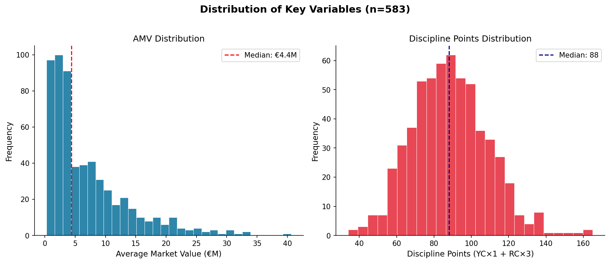

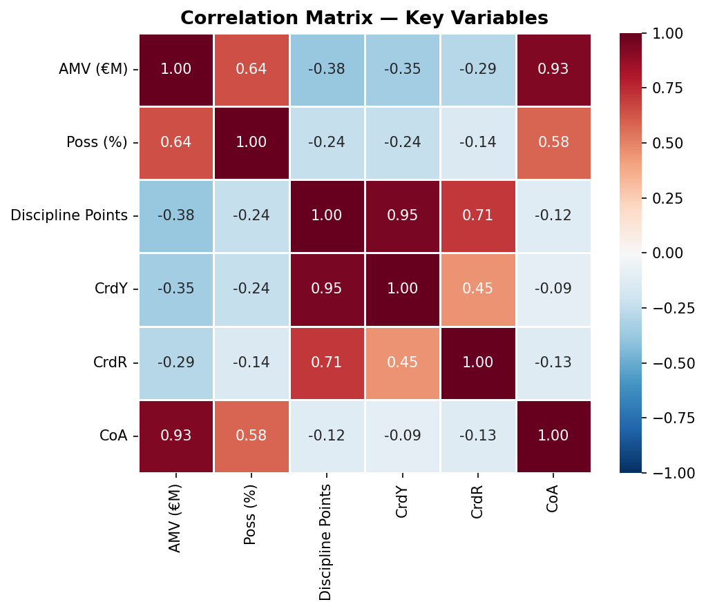

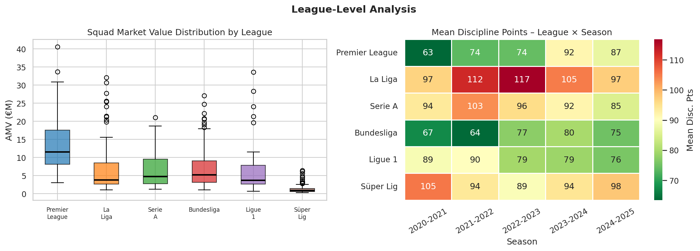

The negative AMV–discipline correlation holds across all five seasons (r ranging from −0.32 to −0.47), ruling out a single-season artifact.

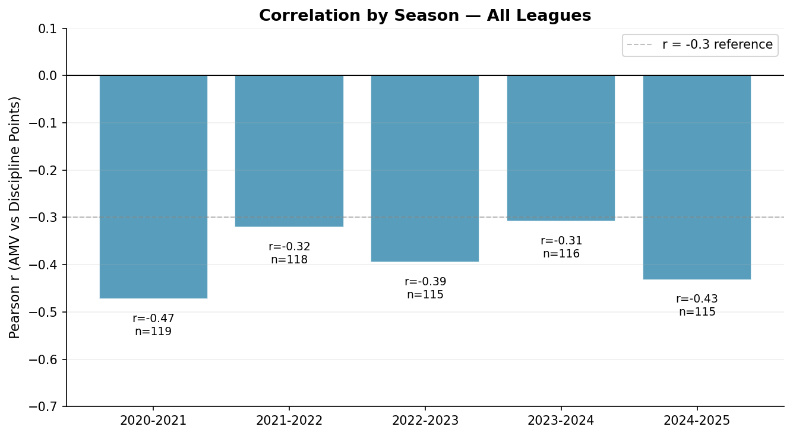

---

### Hypothesis Testing

Four statistical tests were conducted at α = 0.05.

**Test 1: Pearson Correlation**
> r = −0.377, p < 0.001, 95% CI = [−0.450, −0.301]. Medium effect size. **H₀ rejected.**

**Test 2: Spearman Rank Correlation**
> ρ = −0.355, p < 0.001. Confirms result is not driven by outliers or distributional assumptions.

**Test 3: Independent Samples t-test**
> High-AMV teams: 83 pts vs Low-AMV teams: 94 pts. Mean difference 11.1 pts (t = −6.86, p < 0.001, Cohen's d ≈ 0.57).

**Test 4: One-way ANOVA**
> Significant difference in Discipline Points across leagues (p < 0.001). League identity is an important covariate.

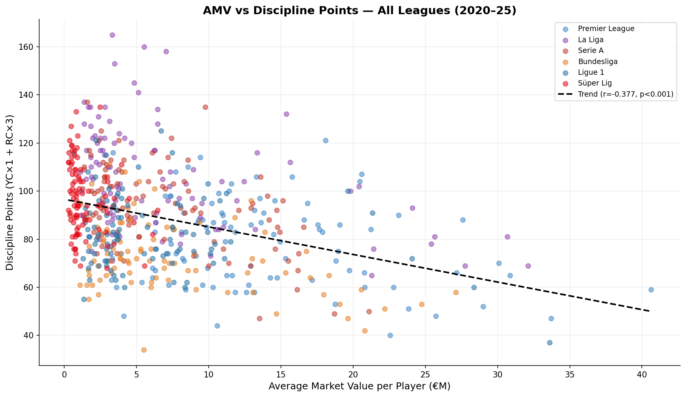

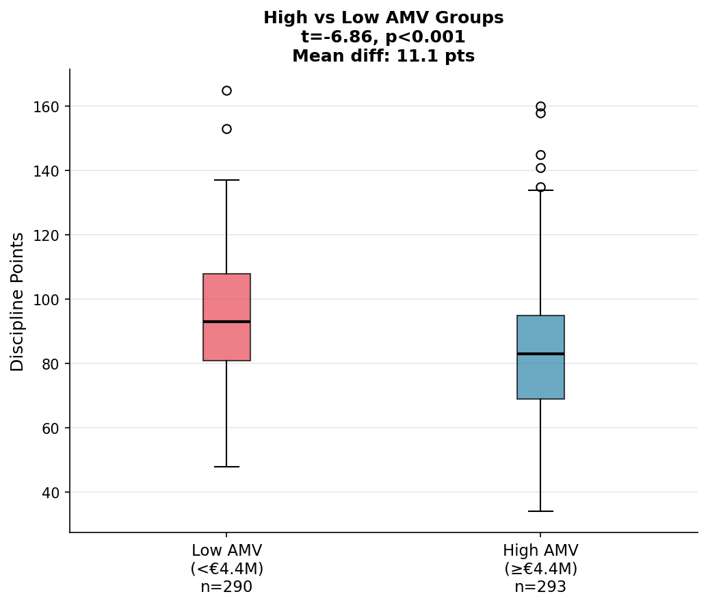

#### League-by-League Breakdown

| League | n | Pearson r | Spearman ρ | Significant? |
|--------|---|-----------|------------|-------------|
| Premier League | 100 | −0.212 | −0.116 | ⚠️ Pearson only |
| La Liga | 100 | −0.431 | −0.414 | ✅ Yes |
| Serie A | 100 | −0.516 | −0.417 | ✅ Yes |
| Bundesliga | 90 | −0.413 | −0.302 | ✅ Yes |
| Ligue 1 | 100 | −0.231 | −0.067 | ⚠️ Pearson only |
| Süper Lig | 93 | −0.249 | −0.296 | ✅ Yes |
| **All Leagues** | **583** | **−0.377** | **−0.355** | ✅ p < 0.001 |

The Premier League and Ligue 1 show significant Pearson but non-significant Spearman correlations. Manchester City and PSG represent extreme outliers combining very high AMV with unusually low Discipline Points, exerting a disproportionate pull on the Pearson correlation. Spearman's rank-based structure is resistant to this pull, which explains the divergence. In leagues where the relationship is more evenly distributed across clubs (Serie A, La Liga, Bundesliga) both measures converge.

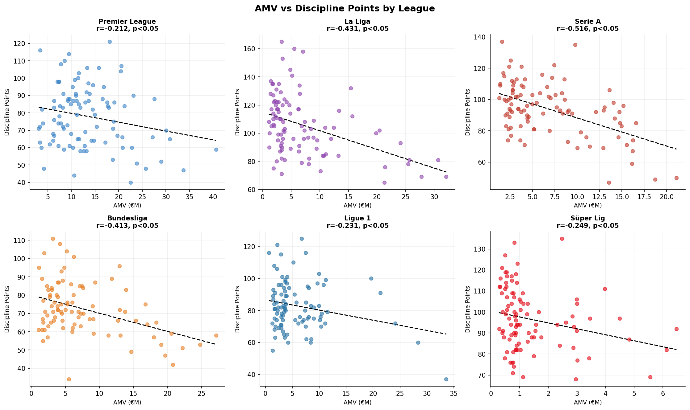

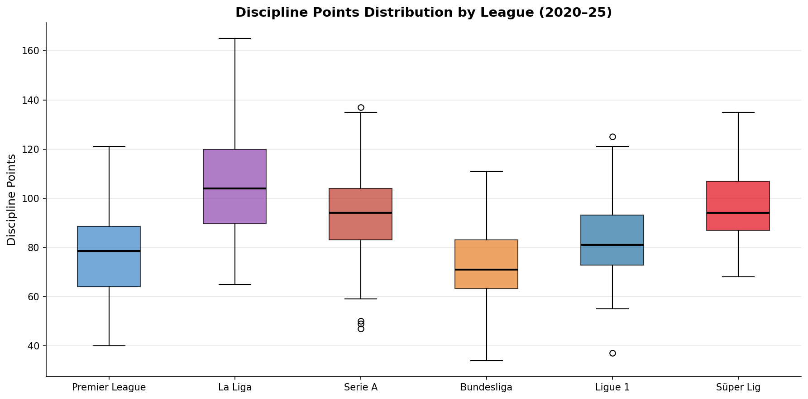

Possession is confirmed as a mediating variable (r = −0.238, p < 0.001): wealthier teams control the ball more, structurally reducing their need for defensive fouls.

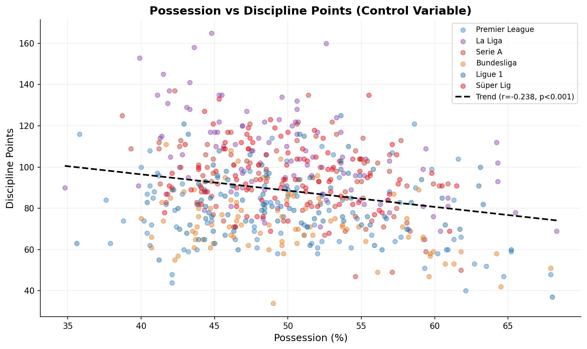

---

### Machine Learning

**Feature set:** AMV (€M), Possession (%), one-hot encoded League, ordinal-encoded Season.  
CrdY, CrdR, and CoA were excluded to prevent data leakage. 80/20 train-test split (random_state=42).

#### Regression: Predicting Discipline Points

| Model | R² | MAE | RMSE |
|-------|-----|-----|------|
| Linear Regression | **0.4125** | 13.51 | 16.89 |
| Ridge (α=1.0) | **0.4125** | 13.52 | 16.89 |
| Lasso (α=0.1) | 0.4109 | 13.55 | 16.91 |
| Random Forest | 0.3858 | 13.70 | 17.27 |

The models explain approximately 41% of discipline point variance. The remaining 59% reflects inherent noise in football: referee tendencies, match context, individual decisions.

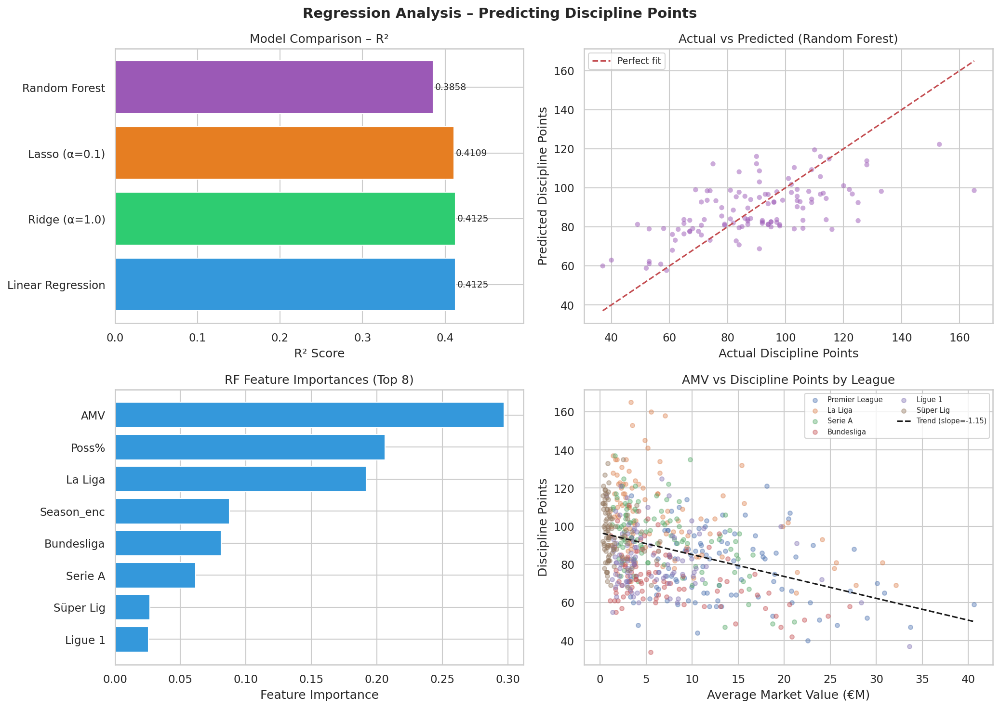

#### Clustering: Team Profiles

K-Means (k=2, silhouette = 0.426):

| Cluster | AMV (€M) | Disc. Points | Poss (%) | n |
|---------|----------|--------------|----------|---|
| Low Value / Aggressive | 3.93 | 94.3 | 48.2% | 430 |
| High Value / Disciplined | 15.68 | 72.4 | 55.2% | 153 |

The **22-point discipline gap** combined with a **7% possession differential** is the project's most striking finding.

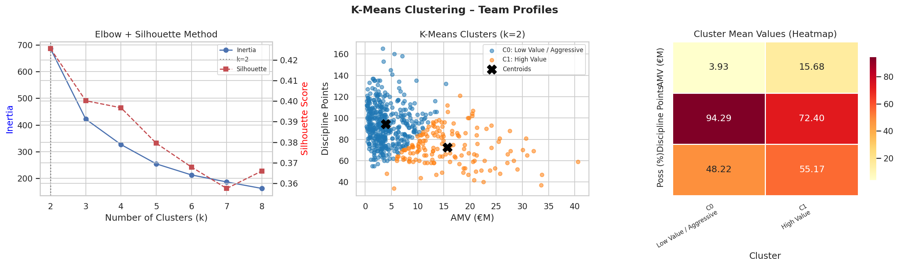

#### Classification: Aggression Level Prediction

Discipline Points binned: Low (< 79), Medium (79–96), High (> 96). Random baseline: 33%.

| Model | Accuracy |
|-------|----------|
| Logistic Regression | 0.5128 |
| Random Forest | 0.4786 |
| KNN (k=7) | 0.4701 |

5-Fold CV (Random Forest): 0.5403 ± 0.0400. "High aggression" class most reliably predicted (F1 = 0.65); "Medium" hardest (F1 = 0.29).

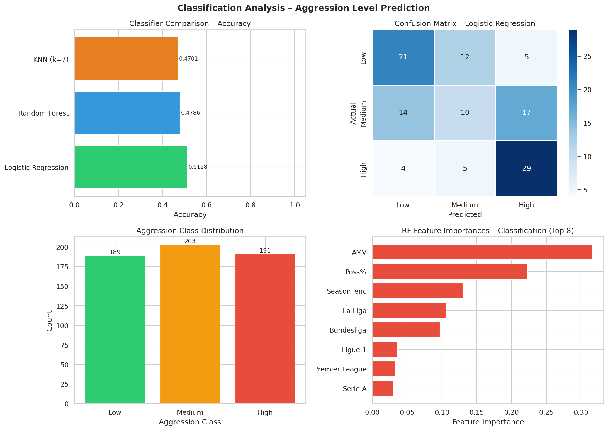

---

## Findings

1. **Significant negative correlation** between AMV and Discipline Points across all 583 observations (r = −0.377, p < 0.001; ρ = −0.355, p < 0.001). Medium effect size.
2. **High-AMV teams average 11 fewer Discipline Points** per season (t-test p < 0.001, Cohen's d ≈ 0.57), roughly 11 additional yellow cards for low-AMV sides.
3. **Relationship holds in 4 of 6 leagues** on both Pearson and Spearman measures. Premier League and Ligue 1 are outlier-driven.
4. **Stable across all five seasons**, with no season showing a positive or null correlation.
5. **K-Means identifies two natural profiles**: High Value / Disciplined vs Low Value / Aggressive, separated by 22 Discipline Points and €11.75M in AMV.
6. **Possession partially mediates** the AMV–discipline relationship.
7. **R² = 0.4125**, squad-level features explain 41% of discipline variance; the rest is in-game randomness.

---

## Limitations

- **Confounding variables:** Managerial philosophy, tactical formation, and individual player profiles are not captured.
- **Cross-league comparability:** Referee standards differ across competitions, introducing systematic noise.
- **Transfermarkt subjectivity:** Community-estimated valuations may reflect form and media profile, not just ability.
- **Temporal autocorrelation:** The same club appears up to 5 times; a panel fixed-effects model would be more rigorous.
- **Excluded leagues:** Six leagues limits generalizability to other financial and cultural contexts.

## Future Work

- Panel data modeling with club fixed-effects for causal interpretation
- Player-level analysis (cards per 90 mins vs individual market value)
- Causal inference via instrumental variables or difference-in-differences
- Referee fixed effects to control for cross-league disciplinary variance
- Extended time horizon (10+ seasons) to track trends as transfer fees inflate

---

## How to Reproduce

```bash
pip install -r requirements.txt
python scripts/01_data_collection.py
python scripts/02_eda.py
python scripts/03_hypothesis_testing.py
python scripts/04_ml_analysis.py
```

---

## AI Usage Disclosure

Generative AI tools (Claude, Anthropic and Gemini, Google) were used during the brainstorming, coding, and writing phases of this project. All prompts and generated outputs are documented in [`AI_Usage_Logs.md`](AI_Usage_Logs.md) as required by DSA 210 course policy. All analytical decisions, dataset choices, statistical interpretations, and conclusions are the author's own.
